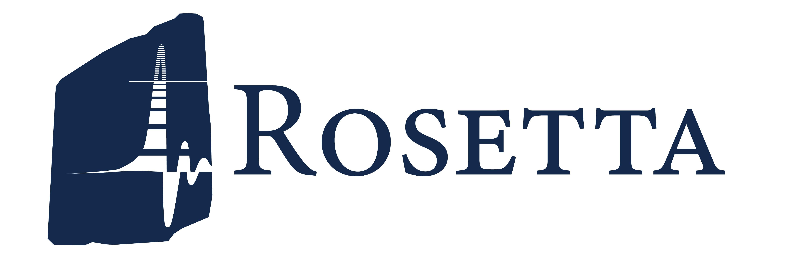

# Rosetta Documentation

This repository contains source files used to auto-generate documentation for Rosetta using Sphinx.

## Contents of this repository

- `.vscode/` = Visual Studio Code configurations.
- `docs/` = Root that houses the Sphinx source code.
  - `source/` = Source files that gets reinterpreted by Sphinx into web-friendly files.
  - `make.bat` and `Makefile` = Configuration files to build this documentation.
- `pyproject.toml`, `.gitignore`, `.prettierignore`, `.all-contributorsrc`, and `.readthedocs.yaml` = Additional configurations for Git, Prettier (code auto-reformatting), all-contributors (attribution of contributors), and ReadTheDocs (web provider for the live version of this documentation).
- `requirements.txt` and `environment.yml` = Packages to recreate the development environment for this documentation using Pip and Conda respectively.

## Locally building the document

To render the Sphinx document as HTML files, run the command below.

`sphinx-build -M html docs/source/ docs/build/`

## License

See the attached license file for more information. License term compliance is inspected using FOSSA:

## Contributors

<!-- ALL-CONTRIBUTORS-LIST:START - Do not remove or modify this section -->
<!-- prettier-ignore-start -->
<!-- markdownlint-disable -->
<table>
  <tbody>
    <tr>
      <td align="center" valign="top" width="14.28%"><a href="https://keitaay.com/"> <b>Keita Yokoyama</b></a> <a href="https://github.com/rosetta-code/rosetta-doc/commits?author=keitaay" title="Code">💻</a> <a href="https://github.com/rosetta-code/rosetta-doc/commits?author=keitaay" title="Documentation">📖</a> <a href="#a11y-keitaay" title="Accessibility">️️️️♿️</a> <a href="#business-keitaay" title="Business development">💼</a> <a href="#content-keitaay" title="Content">🖋</a> <a href="#design-keitaay" title="Design">🎨</a> <a href="#ideas-keitaay" title="Ideas, Planning, & Feedback">🤔</a> <a href="#infra-keitaay" title="Infrastructure (Hosting, Build-Tools, etc)">🚇</a> <a href="#projectManagement-keitaay" title="Project Management">📆</a> <a href="#tool-keitaay" title="Tools">🔧</a></td>
    </tr>
  </tbody>
</table>

<!-- markdownlint-restore -->
<!-- prettier-ignore-end -->

<!-- ALL-CONTRIBUTORS-LIST:END -->
<!-- prettier-ignore-start -->
<!-- markdownlint-disable -->

<!-- markdownlint-restore -->
<!-- prettier-ignore-end -->

<!-- ALL-CONTRIBUTORS-LIST:END -->
